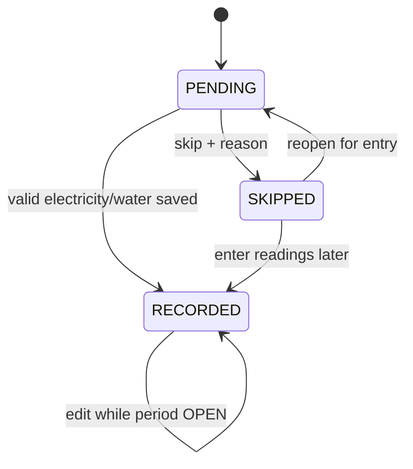
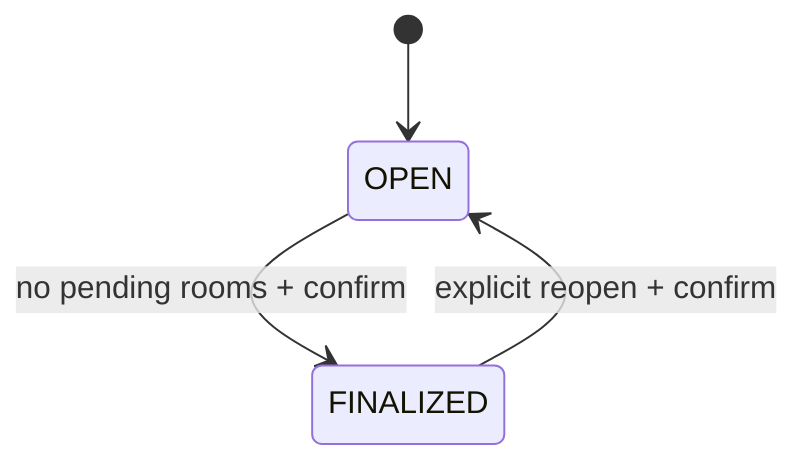
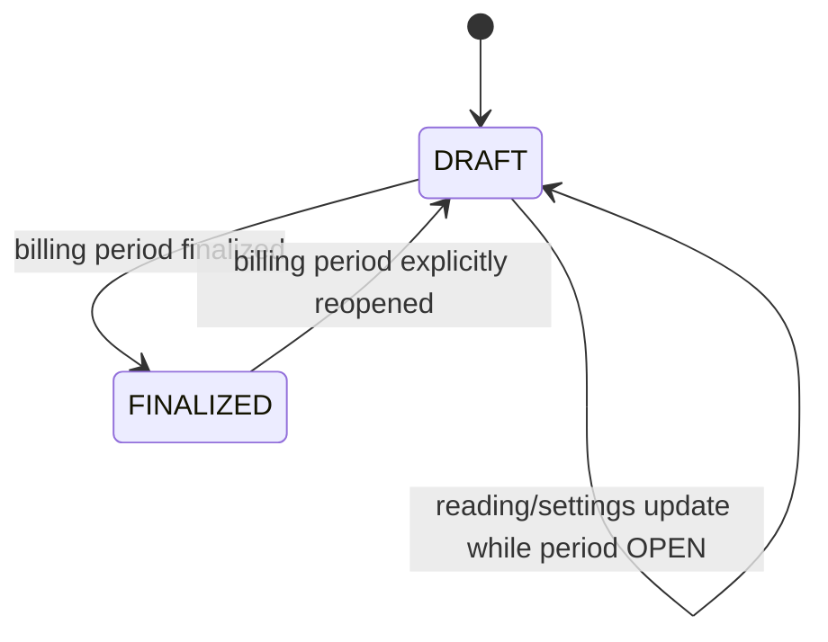

# Nhà trọ 441 — ERD & Database Design

> ERD cho V1 của ứng dụng nhập điện nước và tạo hóa đơn Nhà trọ 441.
> Database: SQLite.
> Thiết kế ưu tiên đơn giản, integrity tốt và dễ migrate sang MySQL/PostgreSQL sau này.

---

# 1. ERD overview

```mermaid
erDiagram
    USERS ||--o{ BILLING_PERIODS : manages

    PROPERTIES ||--o{ FLOORS : has
    FLOORS ||--o{ ROOMS : has

    ROOMS ||--|| ROOM_SETTINGS : has

    PROPERTIES ||--o{ BILLING_PERIODS : has

    BILLING_PERIODS ||--o{ METER_READINGS : contains
    ROOMS ||--o{ METER_READINGS : has

    BILLING_PERIODS ||--o{ INVOICES : contains
    ROOMS ||--o{ INVOICES : receives

    INVOICES ||--o{ INVOICE_ITEMS : contains

    USERS {
        bigint id PK
        string name
        string username UK
        string password
        timestamp created_at
        timestamp updated_at
    }

    PROPERTIES {
        bigint id PK
        string code UK
        string name
        string address nullable
        boolean is_active
        timestamp created_at
        timestamp updated_at
    }

    FLOORS {
        bigint id PK
        bigint property_id FK
        string code
        string name
        integer sort_order
        boolean is_active
        timestamp created_at
        timestamp updated_at
    }

    ROOMS {
        bigint id PK
        bigint floor_id FK
        string room_number
        integer sort_order
        string status
        string note nullable
        boolean is_active
        timestamp created_at
        timestamp updated_at
    }

    ROOM_SETTINGS {
        bigint id PK
        bigint room_id FK
        integer rent_amount
        integer electricity_unit_price
        integer water_unit_price
        integer vehicle_amount
        integer garbage_amount
        integer cable_amount
        integer other_amount
        boolean electricity_enabled
        boolean water_enabled
        string note nullable
        timestamp created_at
        timestamp updated_at
    }

    BILLING_PERIODS {
        bigint id PK
        bigint property_id FK
        string period_key
        date starts_on
        date ends_on
        string status
        bigint finalized_by nullable
        timestamp finalized_at nullable
        timestamp created_at
        timestamp updated_at
    }

    METER_READINGS {
        bigint id PK
        bigint billing_period_id FK
        bigint room_id FK
        string status
        integer electricity_previous nullable
        integer electricity_current nullable
        integer electricity_usage nullable
        integer water_previous nullable
        integer water_current nullable
        integer water_usage nullable
        string skip_reason nullable
        string note nullable
        boolean meter_reset
        timestamp recorded_at nullable
        timestamp created_at
        timestamp updated_at
    }

    INVOICES {
        bigint id PK
        bigint billing_period_id FK
        bigint room_id FK
        string status
        integer subtotal
        integer total
        string note nullable
        timestamp generated_at nullable
        timestamp locked_at nullable
        timestamp created_at
        timestamp updated_at
    }

    INVOICE_ITEMS {
        bigint id PK
        bigint invoice_id FK
        string type
        string description
        integer quantity nullable
        string unit nullable
        integer unit_price nullable
        integer amount
        integer sort_order
        json metadata nullable
        timestamp created_at
        timestamp updated_at
    }
```

---

# 2. Why these tables exist

## 2.1 `users`

V1 chỉ cần một admin.

Không cần role/permission tables.

Mục đích:

- đăng nhập;
- protect app trên LAN;
- lưu user finalize kỳ nếu cần.

---

## 2.2 `properties`

V1 chỉ có một record:

```text
code = 441
name = Nhà trọ 441
```

Vẫn nên có table này thay vì hardcode "441" khắp source.

Không xây multi-property UI trong V1.

---

## 2.3 `floors`

Tầng thuộc property.

Ví dụ:

```text
1 | Tầng 1
2 | Tầng 2
3 | Tầng 3
4 | Tầng 4
```

`sort_order` quyết định thứ tự hiển thị.

Unique đề xuất:

```text
(property_id, code)
```

---

## 2.4 `rooms`

Thông tin phòng.

Ví dụ:

```text
room_number = 101
sort_order = 1
status = OCCUPIED
```

`sort_order` là thứ tự đi ngoài thực tế.

Không mặc định order chỉ bằng `room_number`.

### Room status

```text
OCCUPIED
VACANT
INACTIVE
```

### Constraints

Unique:

```text
(floor_id, room_number)
```

Index:

```text
(floor_id, sort_order)
status
```

Không hard delete room đã có history.

Nếu không dùng nữa:

```text
status = INACTIVE
is_active = false
```

---

# 3. `room_settings`

Một room có một current settings row trong V1.

Relationship:

```text
rooms 1 — 1 room_settings
```

### Fields

```text
rent_amount
electricity_unit_price
water_unit_price
vehicle_amount
garbage_amount
cable_amount
other_amount
electricity_enabled
water_enabled
```

Tất cả money = integer VND.

Ví dụ:

```text
rent_amount = 3200000
electricity_unit_price = 3200
water_unit_price = 17000
vehicle_amount = 120000
garbage_amount = 30000
cable_amount = 0
other_amount = 0
```

### Why no price history table in V1?

Invoice sẽ snapshot giá tại thời điểm tạo/finalize.

Do đó lịch sử hóa đơn không phụ thuộc giá hiện tại.

Nếu sau này cần effective-dated settings, thêm:

```text
room_setting_versions
```

ở V2.

Không cần trong V1.

---

# 4. `billing_periods`

Đại diện tháng.

Ví dụ:

```text
period_key = 2026-08
starts_on = 2026-08-01
ends_on = 2026-08-31
status = OPEN
```

### Status

```text
OPEN
FINALIZED
```

### Unique

```text
(property_id, period_key)
```

### Index

```text
(property_id, status)
period_key
```

---

# 5. `meter_readings`

Một record = một phòng trong một kỳ.

### Unique bắt buộc

```text
(billing_period_id, room_id)
```

Không được có 2 reading record cho cùng phòng/tháng.

---

## 5.1 Status

```text
PENDING
RECORDED
SKIPPED
```

---

## 5.2 Electricity fields

```text
electricity_previous
electricity_current
electricity_usage
```

Khi `RECORDED` và electricity enabled:

```text
electricity_usage =
electricity_current - electricity_previous
```

Không lưu amount tại đây.

Amount thuộc invoice item.

---

## 5.3 Water fields

```text
water_previous
water_current
water_usage
```

Khi `RECORDED` và water enabled:

```text
water_usage =
water_current - water_previous
```

---

## 5.4 Why store `previous` snapshot?

Có thể chỉ lookup kỳ trước mỗi lần, nhưng V1 nên lưu snapshot `previous` trong reading hiện tại vì:

- invoice tháng hiện tại có basis rõ;
- nếu kỳ trước được reopen/correct sau này, reading hiện tại không silently thay đổi;
- dễ audit;
- export đơn giản.

Khi tạo reading lần đầu:

```text
previous = latest valid prior current reading
```

Sau đó không tự đổi `previous` nếu record đã được user xử lý, trừ explicit recalculation/reset action.

---

## 5.5 Skip fields

```text
skip_reason
note
```

Possible `skip_reason`:

```text
NOT_RECORDED_TODAY
VACANT_ROOM
METER_NOT_ACCESSIBLE
METER_PROBLEM
OTHER
```

Nếu status != SKIPPED:

```text
skip_reason = null
```

---

## 5.6 Meter reset

Field:

```text
meter_reset = false
```

Nếu user explicit xác nhận đồng hồ đã thay/reset:

```text
meter_reset = true
```

Khi đó không dùng công thức usage âm.

Cách tính usage sau reset phải được implement explicit.

Nếu chưa có business rule thực tế, V1 có thể:

- cho lưu reset note;
- yêu cầu nhập usage thủ công hoặc new base;
- không tự đoán.

Không silently tạo usage âm.

---

# 6. Previous reading lookup algorithm

Pseudo:

```text
function getPreviousReading(room, period, meterType):
    previousPeriods =
        finalized/open periods before current period
        ordered newest first

    find newest meter_reading where:
        room_id = room.id
        status = RECORDED
        meter current value is not null

    return its current value
```

Nếu không có kỳ trước:

- yêu cầu user nhập "chỉ số đầu kỳ ban đầu" một lần;
- hoặc seed/import initial reading.

Không dùng 0 tự động nếu chưa được user xác nhận.

Có thể implement field-level UI:

```text
Chưa có số cũ
[ Nhập chỉ số ban đầu ]
```

---

# 7. `invoices`

Một room + period có một invoice.

### Unique

```text
(billing_period_id, room_id)
```

### Status

Đề xuất:

```text
DRAFT
FINALIZED
```

Có thể dùng:

```text
LOCKED
```

nếu muốn tách, nhưng không cần nếu `FINALIZED` đã đủ.

### Fields

```text
subtotal
total
note
generated_at
locked_at
```

V1 subtotal có thể bằng total.

Giữ cả hai để mở rộng adjustment/discount sau.

---

# 8. `invoice_items`

Đây là nơi snapshot tài chính.

### Type

```text
RENT
ELECTRICITY
WATER
VEHICLE
GARBAGE
CABLE
OTHER
```

### Example electricity item

```text
type = ELECTRICITY
description = Điện tháng 08/2026
quantity = 217
unit = kWh
unit_price = 3200
amount = 694400
metadata = {
  "previous": 14000,
  "current": 14217
}
```

### Example water item

```text
type = WATER
description = Nước tháng 08/2026
quantity = 4
unit = m3
unit_price = 17000
amount = 68000
metadata = {
  "previous": 343,
  "current": 347
}
```

### Example rent

```text
type = RENT
description = Tiền phòng
quantity = 1
unit = tháng
unit_price = 3200000
amount = 3200000
```

### Example fixed fee

```text
type = GARBAGE
description = Rác
quantity = 1
unit = tháng
unit_price = 30000
amount = 30000
```

---

# 9. Invoice total algorithm

Pseudo:

```text
items = []

if room billable:
    add RENT

if electricity enabled and reading recorded:
    add ELECTRICITY

if water enabled and reading recorded:
    add WATER

if vehicle_amount > 0:
    add VEHICLE

if garbage_amount > 0:
    add GARBAGE

if cable_amount > 0:
    add CABLE

if other_amount != 0:
    add OTHER

subtotal = sum(items.amount)
total = subtotal
```

Không tạo invoice finalized cho PENDING reading.

---

# 10. VACANT rule

V1 mặc định:

Nếu room status = VACANT trong kỳ:

```text
rent = 0
meter bill = 0
fixed fees = 0
```

Nhưng phải cho user explicit kiểm soát nếu nghiệp vụ sau này khác.

Quan trọng:

- `room.status` là trạng thái hiện tại;
- invoice kỳ cũ đã snapshot nên không đổi theo status hiện tại.

Nếu room đang OCCUPIED nhưng user skip với reason VACANT_ROOM:

- hỏi user có update room.status không;
- không auto silently.

---

# 11. Invoice snapshot invariants

Sau khi invoice FINALIZED:

1. Không recalc theo room_settings mới.
2. Không update amount vì price mới.
3. Không update metadata vì reading kỳ khác.
4. Export luôn lấy invoice snapshot.
5. Nếu cần sửa:
   - reopen billing period;
   - sửa;
   - explicit regenerate;
   - finalize lại.

---

# 12. Constraints summary

## `users`

```text
UNIQUE username
```

## `properties`

```text
UNIQUE code
```

## `floors`

```text
UNIQUE(property_id, code)
```

## `rooms`

```text
UNIQUE(floor_id, room_number)
INDEX(floor_id, sort_order)
```

## `room_settings`

```text
UNIQUE room_id
```

## `billing_periods`

```text
UNIQUE(property_id, period_key)
```

## `meter_readings`

```text
UNIQUE(billing_period_id, room_id)
INDEX(billing_period_id, status)
INDEX(room_id, billing_period_id)
```

## `invoices`

```text
UNIQUE(billing_period_id, room_id)
INDEX(billing_period_id, status)
```

## `invoice_items`

```text
INDEX(invoice_id, sort_order)
INDEX(type)
```

---

# 13. Suggested Laravel model relationships

```php
Property
  hasMany(Floor::class)
  hasMany(BillingPeriod::class)

Floor
  belongsTo(Property::class)
  hasMany(Room::class)

Room
  belongsTo(Floor::class)
  hasOne(RoomSetting::class)
  hasMany(MeterReading::class)
  hasMany(Invoice::class)

BillingPeriod
  belongsTo(Property::class)
  hasMany(MeterReading::class)
  hasMany(Invoice::class)

MeterReading
  belongsTo(BillingPeriod::class)
  belongsTo(Room::class)

Invoice
  belongsTo(BillingPeriod::class)
  belongsTo(Room::class)
  hasMany(InvoiceItem::class)

InvoiceItem
  belongsTo(Invoice::class)
```

`User` chỉ cần liên kết finalized_by nếu implement audit tối thiểu.

---

# 14. Suggested enums

Có thể dùng PHP backed enums nếu project version hỗ trợ tốt.

## RoomStatus

```text
OCCUPIED
VACANT
INACTIVE
```

## BillingPeriodStatus

```text
OPEN
FINALIZED
```

## MeterReadingStatus

```text
PENDING
RECORDED
SKIPPED
```

## SkipReason

```text
NOT_RECORDED_TODAY
VACANT_ROOM
METER_NOT_ACCESSIBLE
METER_PROBLEM
OTHER
```

## InvoiceStatus

```text
DRAFT
FINALIZED
```

## InvoiceItemType

```text
RENT
ELECTRICITY
WATER
VEHICLE
GARBAGE
CABLE
OTHER
```

---

# 15. State transitions

## Meter reading



Nếu period FINALIZED:

```text
no normal transition
```

phải reopen period.

---

## Billing period



---

## Invoice



---

# 16. Transaction boundaries

## Save reading + invoice

Nên transaction:

```text
BEGIN

validate period OPEN
upsert/save meter_reading
calculate usage
set RECORDED
recalculate draft invoice
save invoice
replace/update invoice_items

COMMIT
```

Transaction phải ngắn.

Không render PDF/Excel/DOCX trong cùng transaction.

---

# 17. Concurrency notes for SQLite

Quy mô chỉ khoảng 45 phòng, nhưng có thể có 2 điện thoại.

Yêu cầu:

- WAL mode nếu phù hợp.
- Busy timeout.
- Transaction ngắn.
- Không giữ write transaction qua request dài.
- Unique constraints để chống duplicate.
- Khi 2 thiết bị cùng sửa một phòng, cân nhắc stale-update detection bằng `updated_at`/version nếu cần.

V1 có thể xử lý đơn giản:

- nếu `updated_at` thay đổi kể từ lúc form load, cảnh báo dữ liệu đã được cập nhật ở thiết bị khác.

Không cần distributed lock.

---

# 18. SQLite migration notes

SQLite hỗ trợ tốt cho V1 nhưng migration nên tránh các pattern khó migrate sau.

Ưu tiên:

- normal integer/string/date/timestamp;
- JSON metadata nếu framework/SQLite version phù hợp;
- foreign keys;
- indexes.

Không dùng SQLite-specific SQL trong business logic.

---

# 19. Initial reading bootstrap

Problem:

Kỳ đầu tiên chưa có previous reading trong DB.

Flow đề xuất:

```text
PHÒNG 101

Chưa có chỉ số điện kỳ trước.

[ Nhập số đầu kỳ điện: ______ ]

Chưa có chỉ số nước kỳ trước.

[ Nhập số đầu kỳ nước: ______ ]
```

Sau khi lưu:

- đây là baseline cho kỳ đầu;
- current của kỳ này vẫn nhập bình thường.

Có thể seed/import các số cuối tháng trước từ Excel sau này.

Import không bắt buộc Phase 2 nếu chưa có file chuẩn.

---

# 20. Example end-to-end data

## Room setting

```text
Room 101

rent = 3,200,000
electricity_unit_price = 3,200
water_unit_price = 17,000
vehicle = 120,000
garbage = 30,000
cable = 0
other = 0
```

## Previous period

```text
2026-07

electricity_current = 14,000
water_current = 343
```

## Current period

```text
2026-08

electricity_previous = 14,000
electricity_current = 14,217
electricity_usage = 217

water_previous = 343
water_current = 347
water_usage = 4
```

## Invoice items

```text
RENT
3,200,000

ELECTRICITY
217 × 3,200 = 694,400

WATER
4 × 17,000 = 68,000

VEHICLE
120,000

GARBAGE
30,000
```

## Total

```text
4,112,400 VND
```

---

# 21. Data export mapping

## Excel columns

```text
room.room_number
room_settings.rent_amount snapshot from invoice item
electricity previous
electricity current
electricity usage
electricity unit price from invoice item
electricity amount
water previous
water current
water usage
water unit price from invoice item
water amount
vehicle item
garbage item
cable item
other item
invoice.total
reading.status
reading.note
```

Important:

- giá và amount của export lấy từ invoice snapshot;
- readings lấy từ meter_reading / invoice metadata.

---

# 22. Deletion policy

Không hard-delete các record đã liên quan tới billing history.

## Property/floor/room

Dùng:

```text
is_active = false
status = INACTIVE
```

## Billing period

Không xóa finalized period bằng UI.

## Meter reading

Không xóa finalized reading.

## Invoice

Không xóa finalized invoice.

---

# 23. Audit scope V1

Không cần full audit log table.

Tối thiểu có:

```text
created_at
updated_at
recorded_at
finalized_at
finalized_by
locked_at
```

Nếu thực tế hai người dùng cùng lúc nhiều và cần biết ai nhập, V2 có thể thêm:

```text
recorded_by
updated_by
```

---

# 24. Backup/restore

SQLite DB phải nằm ngoài public web root.

Ví dụ:

```text
database/database.sqlite
```

hoặc location an toàn tương đương.

Backup folder:

```text
storage/app/backups/
```

Không commit backup lên Git.

Restore process phải được README mô tả.

---

# 25. Future migration path

Nếu sau này cần public/hosted nhiều user:

```text
SQLite
   ↓
PostgreSQL / MySQL
```

Thiết kế hiện tại chủ ý dùng:

- relational schema;
- integer money;
- foreign keys;
- indexes;
- service-level business logic;

để migration dễ.

Không có lý do dùng MongoDB cho V1.

---

# 26. ERD implementation checklist

Codex khi tạo migration phải kiểm tra:

- [ ] FK đúng.
- [ ] FK delete behavior không làm mất lịch sử.
- [ ] unique constraints đúng.
- [ ] indexes đúng.
- [ ] money integer.
- [ ] period key unique theo property.
- [ ] room number unique theo floor.
- [ ] reading unique theo room + period.
- [ ] invoice unique theo room + period.
- [ ] room setting unique theo room.
- [ ] SQLite foreign keys enabled.
- [ ] timestamps đầy đủ.
- [ ] finalized history không bị cascade delete.
